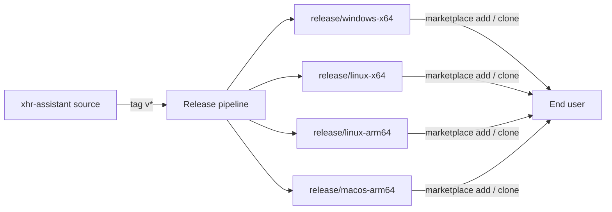

# xHR Plugins Marketplace

This repository distributes **xHR Assistant** — the plugin that lets AI
assistants (Claude Code, OpenAI Codex, and Google Antigravity) work with an
xHR workspace through natural conversation: leave balances, time off,
timesheets and shifts, employee and document lookup, Workbench projects, and
20+ other product domains.

## How distribution works

- The **default branch** holds only the marketplace catalogs and the README.
- Each **`release/<platform>` branch** holds exactly one commit with the
  latest packaged plugin for that platform: the self-contained MCP binary,
  the router skills, and the vendored execution runtime. Users need no
  Python, no Git access to source repositories, and no build step.
- The per-version archive history lives in the GitHub Releases of the
  (private) plugin source repository.

## Installing

See the [README](https://github.com/xhr-labs/agent-xhr-plugins#readme) for
the full end-user guide: platform picker, per-host install commands,
first-time sign-in, environment switching, updating, and troubleshooting.

## Security model in one paragraph

The plugin exposes three managed MCP tools (`read`, `exec`, `authenticate`).
Access tokens are validated against xHR Platform and stored only in the OS
credential store; identity and tenant scope are re-verified server-side on
every execution. The AI model never sees credentials, and header-like
arguments are rejected at the tool contract.
